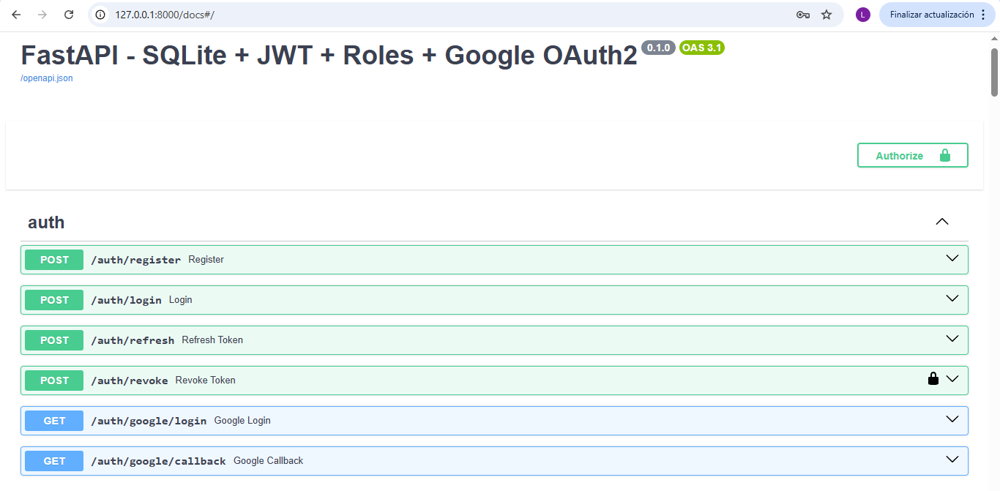
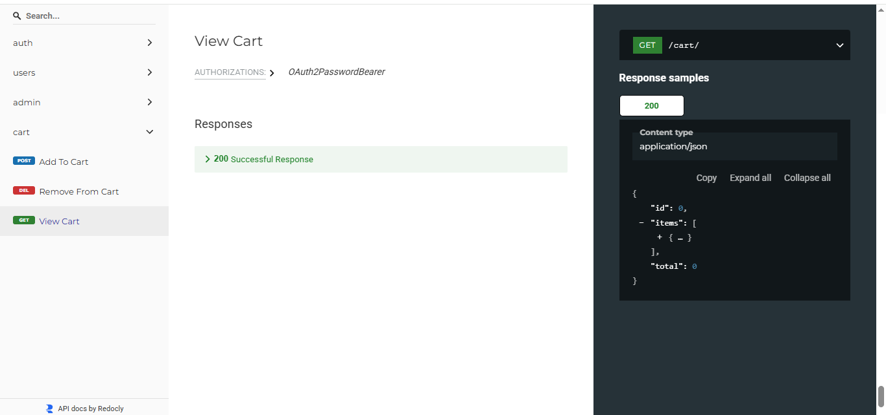

# FastAPI Project with Admin, Products & Cart

A full-featured FastAPI application using SQLite, JWT authentication, roles & permissions, and Google OAuth2 scaffold. Includes complete CRUD for products and cart management.

---

## Features

### Authentication & Authorization
- JWT access tokens + persistent DB-backed refresh tokens
- Token revocation system
- Role-based access control (User, Admin, etc.)
- Protected endpoints requiring roles
- Google OAuth2 Sign-in (scaffold, requires Google Cloud credentials)

### CRUD Operations
- **Products**: Create, Read, Update, Delete
- **Cart**: Add, remove, update items
- **Admin routes**: Manage users, roles, products, and orders

### Database
- SQLite local DB (`DATABASE_URL=sqlite:///./database.db`)
- Models: Users, Roles, UserRoles, Products, Cart, Orders, RefreshTokens

---
Data Files


###UI 2



## Environment Setup

Create a `.env` file with the following variables:

```env
# SECURITY
SECRET_KEY=your-secret-key
ACCESS_TOKEN_EXPIRE_MINUTES=15
REFRESH_TOKEN_EXPIRE_DAYS=30

# DATABASE
DATABASE_URL=sqlite:///./database.db

# GOOGLE OAUTH2 (optional)
GOOGLE_CLIENT_ID=your-google-client-id.apps.googleusercontent.com
GOOGLE_CLIENT_SECRET=your-google-client-secret
GOOGLE_REDIRECT_URI=http://127.0.0.1:8000/auth/google/callback
Quick Start (Local)
1️⃣ Create and activate virtual environment
python -m venv venv
# Linux / Mac
source venv/bin/activate
# Windows
venv\Scripts\activate
2️⃣ Install dependencies
cd project
pip install -r requirements.txt
3️⃣ Setup environment: in the env
4️⃣ Run the application
uvicorn app:app --reload --port 8000
5️⃣ Access API docs
Swagger UI: http://127.0.0.1:8000/docs

Redoc: http://127.0.0.1:8000/redoc

Admin Routes
Admin-only routes protected with role-based dependency

Manage users, roles, products, and orders


Notes
Google OAuth2 requires GOOGLE_CLIENT_ID, GOOGLE_CLIENT_SECRET, and GOOGLE_REDIRECT_URI.

Refresh tokens are stored in DB and support revocation.

Roles system allows creating and assigning roles to users; use require_role() dependency for endpoint protection.
